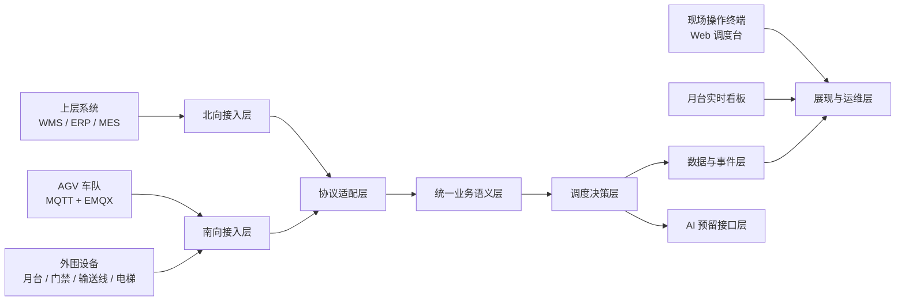
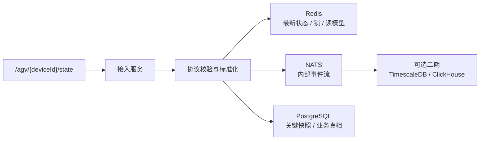
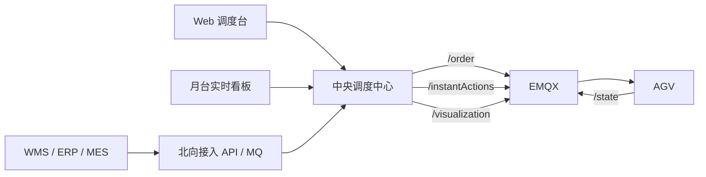
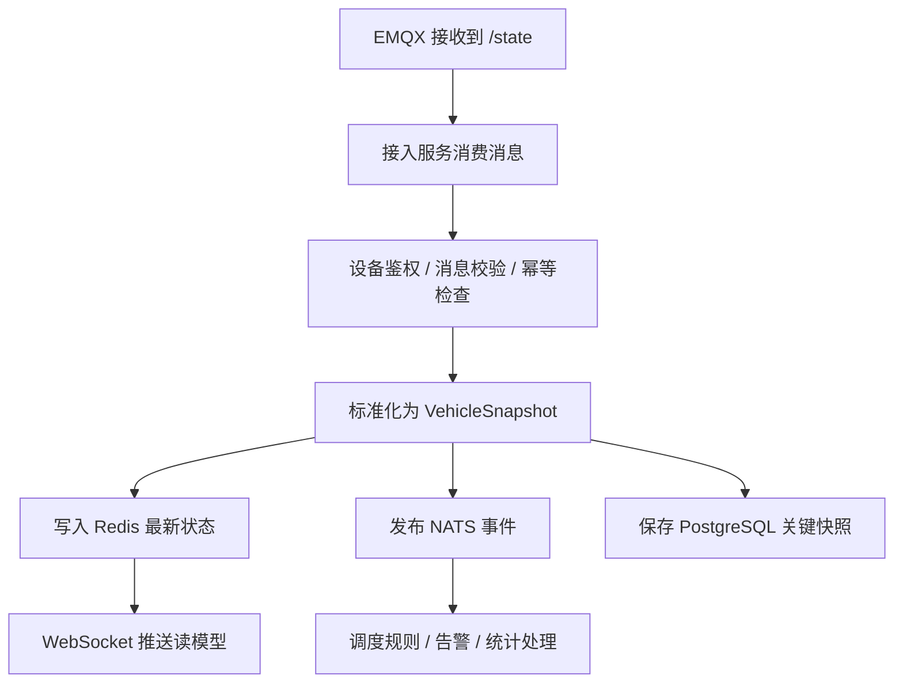
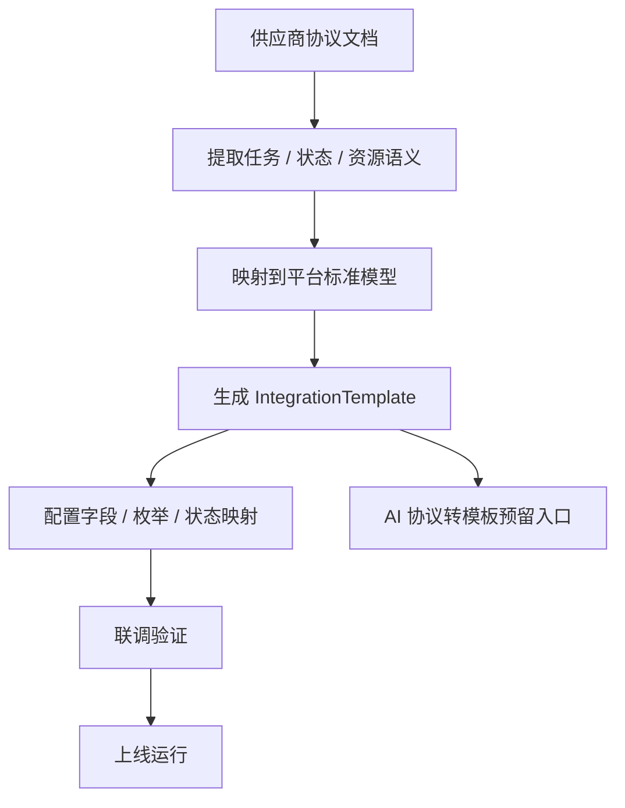
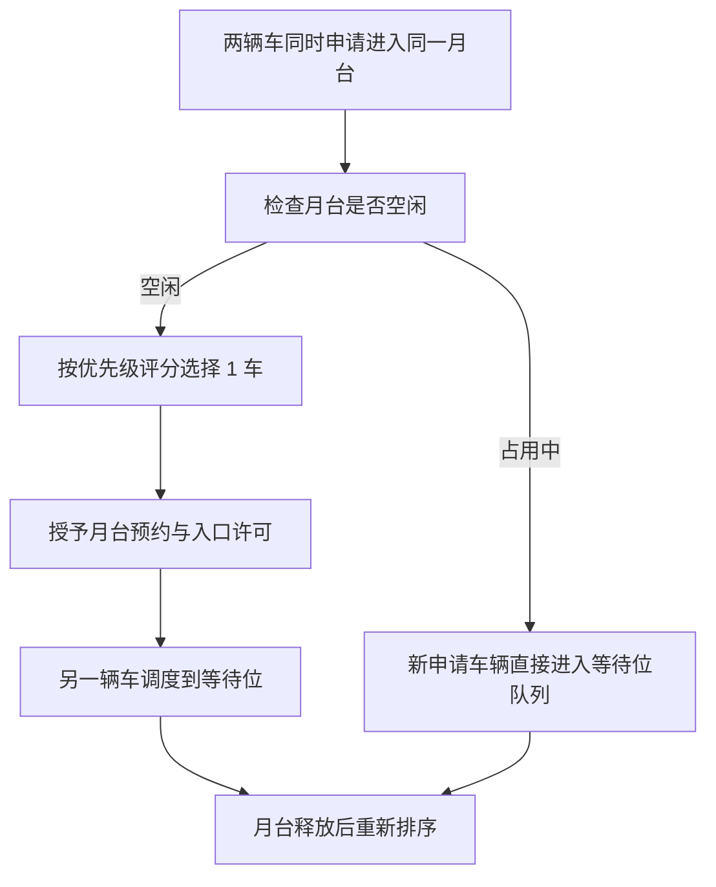
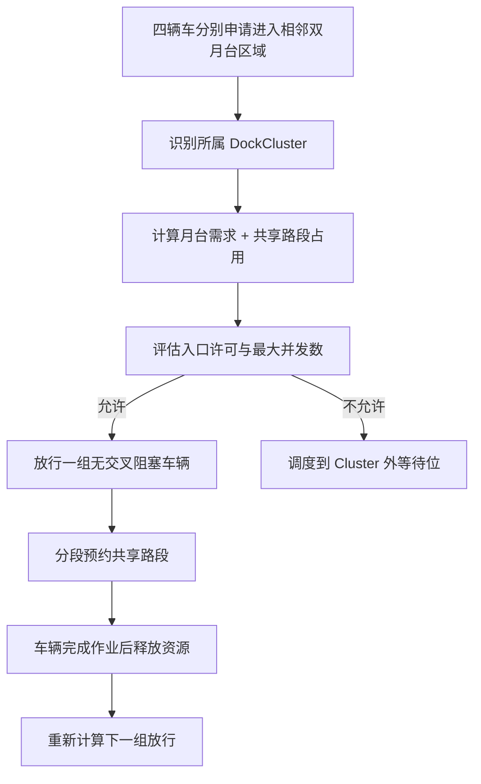
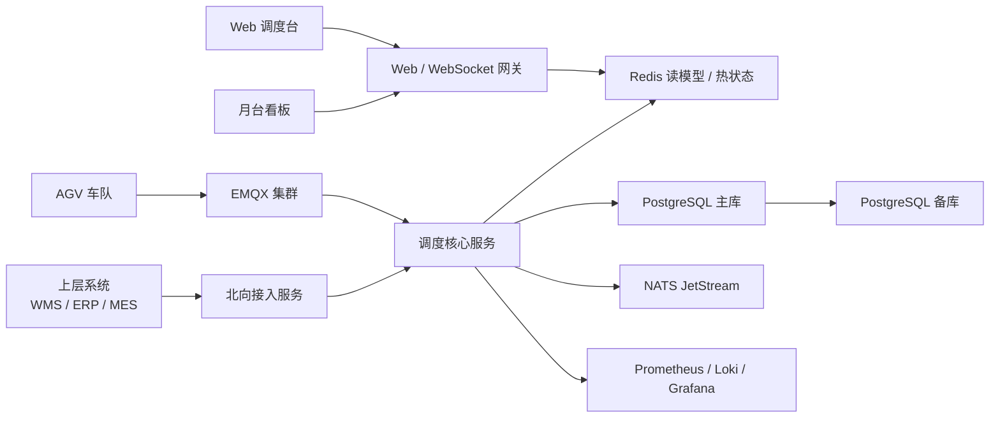
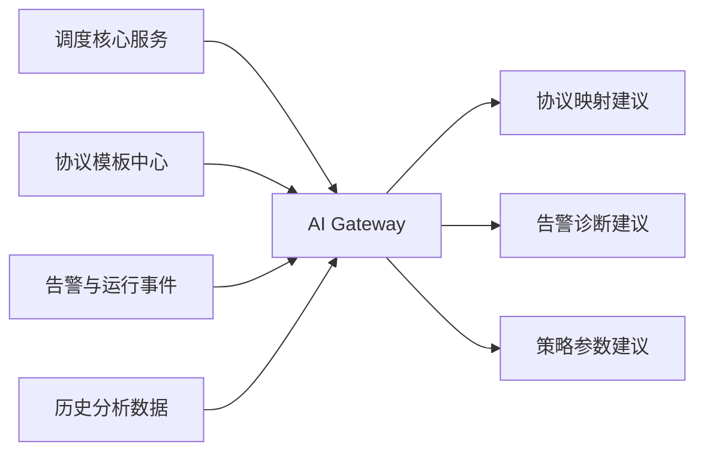

# AGV中央调度中心技术方案

## 1. 项目背景与设计目标

### 1.1 项目背景

本项目面向正式生产环境下的 AGV 集群调度场景，中央调度中心需要统一承接来自上层业务系统、现场操作终端、AGV 车队和外围设备的运行数据与控制指令，在保障安全与稳定的前提下，实现多车、多月台、多任务、多系统并发协同。

与单机测试工具或单站点看板不同，本方案的中央调度中心并不是简单的任务转发程序，而是一个承担统一调度、统一资源协调、统一状态汇聚、统一异常处理、统一对外协同的核心平台。

### 1.2 设计目标

本方案按以下极限场景进行架构设计：

- `1000` 辆 AGV 同时接入中央调度中心
- `300` 个月台同时纳入统一资源管理
- AGV 通过 `MQTT + EMQX` 与中央调度中心通信
- `/agv/{deviceId}/state` 主题每秒上报一次状态
- 多个月台可各自打开 Web 可视化页面，实时展示本月台或本区域相关状态
- 上层系统可能来自不同供应商，需支持 `WMS/ERP/MES` 的模板化接入
- 后续需要接入 AI 模块，但 AI 不直接进入首版调度主闭环

### 1.3 设计边界

本方案重点设计中央调度中心及其周边系统，不覆盖以下内容：

- AGV 本体底层导航算法与控制器实现
- AGV 本地避障图像处理链路
- PLC、输送线、电梯等外围设备的底层驱动细节
- 具体数据库建表 SQL 与代码实现

### 1.4 部署假设

本方案默认采用现场私有化部署：

- 中央调度中心部署在客户现场服务器或工控服务器上
- 核心数据保存在现场数据库中
- 默认按单机房高可用设计，不按跨地域双活设计
- 现场网络允许 EMQX、调度服务、数据库、Redis、NATS 和 Web 服务互通

## 2. 总体架构设计

### 2.1 架构设计原则

- 调度核心与展示层解耦，避免 Web 波动影响核心调度
- 协议适配与业务语义解耦，避免供应商协议直接侵入调度内核
- 热状态、事务数据、事件流分层存储，避免单一数据库承担全部职责
- 首版优先正确性、稳定性、可观测性，后续再逐步增强优化能力
- AI 模块采用旁路接入方式，避免对调度主链路造成不确定风险

### 2.2 总体逻辑架构图

### 2.3 分层说明

#### 2.3.1 接入层

接入层负责所有外部连接的统一入口，包括：

- AGV MQTT 接入
- 北向上层系统 API 或消息接入
- 外围设备状态接入
- Web 管理端与看板端访问接入

接入层只负责接入、鉴权、限流、协议解析前置处理，不承担业务决策。

#### 2.3.2 协议适配层

协议适配层负责把不同来源的数据转换为平台内部统一模型，主要包括：

- AGV MQTT 协议适配器
- 北向系统协议适配器
- 外围设备适配器

这样做的核心目的是隔离不同客户、不同供应商、不同设备之间的协议差异。

#### 2.3.3 统一业务语义层

统一业务语义层定义平台内部的标准对象与标准动作，例如：

- `TransportTask`
- `TaskStep`
- `VehicleSnapshot`
- `DockSnapshot`
- `ZoneReservation`
- `DispatchDecision`
- `AlarmEvent`
- `IntegrationTemplate`

这一层是模板化对接和后续 AI 协议映射能力的基础。

#### 2.3.4 调度决策层

调度决策层是中央调度中心的核心，承担：

- 任务分配
- 月台资源预约
- 关键区域互斥控制
- 冲突消解
- 异常降级
- 人工介入后的重新编排

#### 2.3.5 数据与事件层

数据与事件层负责：

- 事务数据持久化
- 热状态缓存
- 内部异步事件流
- 读写分离支撑
- 历史归档与分析预留

#### 2.3.6 展现与运维层

展现与运维层负责：

- Web 调度台
- 月台看板
- 告警中心
- 历史追溯
- 运维监控
- 审计与配置管理

## 3. 技术栈推荐与选型理由

### 3.1 推荐技术栈总览

| 模块 | 推荐技术 | 选型理由 |
| --- | --- | --- |
| 核心后端 | `Go` | 并发效率高、资源占用低、现场私有化部署轻量、适合实时处理 |
| MQTT Broker | `EMQX` | 工业 MQTT 场景成熟，支持设备接入和路由转发 |
| 事务数据库 | `PostgreSQL` | 事务能力稳定，适合任务、配置、审计、告警等业务真相存储 |
| 热状态缓存 | `Redis` | 适合保存车辆最新状态、月台占用态、资源锁和实时会话数据 |
| 内部事件总线 | `NATS JetStream` | 轻量、低延迟、适合现场部署与内部异步解耦 |
| Web 前端 | `Next.js + React + TypeScript` | 适合管理端与实时看板统一建设 |
| 实时推送 | `WebSocket` | 适合高频状态变化向 Web 看板推送 |
| 监控与日志 | `Prometheus + Grafana + Loki + OpenTelemetry` | 指标、日志、链路观测体系完整 |

### 3.2 为什么核心后端推荐 Go

本项目的主要复杂度不在传统 CRUD，而在以下几个方面：

- 高频状态接入
- 大量连接并发
- 低延迟调度决策
- 实时推送
- 资源锁与异步事件协同

Go 在这些方面具备明显优势：

- 并发模型简单，适合高连接数服务
- 单二进制部署更适合现场环境
- 资源占用较低，利于本地服务器长期运行
- 对 MQTT、gRPC、WebSocket、Redis、PostgreSQL 的生态支持较完善

### 3.3 为什么不建议首版把所有能力都做成重微服务

对于首版中央调度中心，更重要的是职责清晰而不是服务数量多。若在首版即把任务调度、资源调度、告警、适配器、看板全部拆得过细，会明显增加：

- 运维复杂度
- 配置复杂度
- 故障排查成本
- 跨服务一致性难度

因此建议采用“按领域清晰拆分、按部署可组合”的设计方式，可以是模块化单体或少量核心服务组合，在后续业务增长后再根据压力点拆分。

## 4. 数据库与实时数据架构

### 4.1 设计原则

中央调度中心的数据必须分层管理，不能把所有数据都压到单一数据库中。原因在于：

- 高频状态流与事务数据的访问模式完全不同
- Web 看板的读压力与调度写压力完全不同
- 历史分析与在线调度的性能要求完全不同

因此，本方案采用“事务库 + 热状态缓存 + 事件流 + 可选历史分析库”的组合方式。

### 4.2 1000 车场景下的状态量级估算

已知条件：

- `1000` 台 AGV
- `/state` 每秒上报 `1` 次

则基础状态写入量约为：

- `1000` 条/秒
- `86,400,000` 条/天

如果单条状态按 `2 KB` 有效载荷估算，则每日原始状态数据约：

- `172.8 GB/天`

如果单条状态按 `5 KB` 估算，则每日原始状态数据约：

- `432 GB/天`

这还未计入：

- 索引开销
- WAL 开销
- 备份开销
- 副本同步开销
- JSONB 膨胀开销

因此，不能把 `/state` 的全量原始数据长期、同步、无分层地直接写入普通 PostgreSQL 业务表。

### 4.3 数据分层建议

| 数据类型 | 存储介质 | 保存内容 |
| --- | --- | --- |
| 业务真相 | `PostgreSQL` | 任务单、任务步骤、车辆台账、月台配置、区域配置、告警、审计、权限、模板配置 |
| 热状态 | `Redis` | 车辆最新状态、月台占用状态、排队列表、资源锁、Web 读模型 |
| 内部事件 | `NATS JetStream` | 状态变更事件、任务流转事件、告警事件、对外通知事件 |
| 高频历史 | `TimescaleDB` 或 `ClickHouse` | 可选二期，用于长周期轨迹、统计分析、运行复盘 |

### 4.4 存储分层图

### 4.5 PostgreSQL 存储原则

PostgreSQL 主要用于保存以下内容：

- 任务单与任务状态机
- 月台、区域、站点、等待位等业务配置
- 人工操作记录
- 告警与处理记录
- 北向集成模板与适配配置
- 关键状态快照

不建议 PostgreSQL 承担以下职责：

- 实时读取所有 AGV 最新状态给所有看板使用
- 保存所有 AGV 每秒全量原始报文长期历史
- 直接承担内部异步消息流转

### 4.6 Redis 使用原则

Redis 主要承担热数据角色：

- `vehicle:latest:{deviceId}` 保存车辆最新状态
- `dock:latest:{dockId}` 保存月台最新状态
- `zone:reservation:{zoneId}` 保存资源预约信息
- `dispatch:queue:{dockId}` 保存月台排队序列
- `screen:view:{screenId}` 保存看板订阅会话与读模型

这样做的好处是：

- Web 看板读取实时数据无需直打事务库
- 调度核心能快速判断月台占用与队列状态
- 资源锁能快速获取与释放

### 4.7 NATS JetStream 使用原则

NATS 用于承接内部异步事件，例如：

- `vehicle.state.updated`
- `task.created`
- `task.assigned`
- `task.finished`
- `dock.occupied`
- `dock.released`
- `alarm.created`

NATS 的作用不是替代数据库，而是把高频异步流与事务持久化解耦。

### 4.8 历史数据建议

首版建议：

- 保存最新态
- 保存关键变更
- 保存任务关键里程碑
- 保存必要的采样历史

二期如明确需要：

- 轨迹回放
- 长周期 KPI 分析
- AI 模型训练输入
- 历史拥堵热区分析

再引入 `TimescaleDB` 或 `ClickHouse` 作为高频历史分析库。

## 5. MQTT 与实时通信链路

### 5.1 MQTT 主题角色

结合当前协议文档，中央调度中心重点关注以下主题：

- `/agv/{deviceId}/state`：AGV 上报状态
- `/agv/{deviceId}/order`：中心向 AGV 下发任务
- `/agv/{deviceId}/instantActions`：中心下发紧急控制
- `/agv/{deviceId}/visualization`：中心下发调试与定位相关控制

### 5.2 南向与北向交互图

### 5.3 `/state` 处理链路

中央调度中心收到 `/state` 后，建议按以下流程处理：

1. 消息接收
2. 设备身份校验
3. 协议版本校验
4. 数据结构校验
5. 标准化映射
6. 更新 Redis 最新状态
7. 发布内部状态变更事件
8. 根据策略保存关键快照
9. 推送 Web 读模型更新

### 5.4 `/state` 数据处理流程图

### 5.5 `/order` 下发链路

任务下发建议采用以下逻辑：

1. 北向系统或 Web 调度台发起任务请求
2. 中心生成标准任务对象
3. 调度层决定具体车辆与路径阶段
4. 转换为 AGV 协议中的 `/order` 消息
5. 经由 EMQX 投递到指定设备
6. 根据 `/state.orderState` 持续跟踪执行闭环

### 5.6 Web 看板实时推送路径

多个月台各开一个 Web 看板时，不能让所有看板全量订阅全厂所有状态。建议：

- 调度台可订阅全局聚合视图
- 月台看板仅订阅本月台或所属 `DockCluster`
- 推送网关从 Redis 或预构建读模型中取数
- 推送服务与核心调度服务部署解耦

## 6. 北向模板化对接设计

### 6.1 设计目标

由于客户现场的 `WMS/ERP/MES` 可能来自不同供应商，如果每个项目都从头写一套接口程序，会导致：

- 重复开发成本高
- 协议维护成本高
- 上线周期不稳定
- 不利于后续 AI 自动映射

因此建议以“统一业务语义模型 + 模板化映射”方式进行北向集成。

### 6.2 统一模型建议

建议在平台内部统一以下对象：

- `TransportTask`
- `TaskStep`
- `VehicleSnapshot`
- `DockSnapshot`
- `ZoneReservation`
- `DispatchDecision`
- `AlarmEvent`
- `IntegrationTemplate`

### 6.3 北向标准能力

建议平台对外统一以下业务能力：

- 创建任务
- 取消任务
- 挂起任务
- 恢复任务
- 查询任务状态
- 回传任务执行结果
- 回传车辆状态
- 回传月台状态

### 6.4 适配器抽象

建议定义以下适配器接口抽象：

- `InboundAdapter`
- `OutboundAdapter`
- `FieldMapper`
- `EnumMapper`
- `StatusMapper`

### 6.5 模板化映射内容

每个客户或供应商协议模板建议包含：

- 字段映射规则
- 枚举值映射规则
- 状态机映射规则
- 鉴权方式配置
- 幂等键规则
- 重试规则
- 错误码映射
- 回调地址与超时策略

### 6.6 北向模板化对接流程图

### 6.7 AI 协议转模板预留位置

后续 AI 模块的目标不应是直接生成一堆临时代码，而是：

- 读取供应商协议文档
- 提取字段与状态语义
- 生成候选映射模板
- 由人工审核后投入使用

这要求首版模板模型必须定义得清晰、稳定、可审计。

## 7. 调度算法与策略设计

### 7.1 调度设计原则

首版调度系统不建议直接追求复杂的全局最优算法，而应先保证：

- 资源互斥正确
- 不发生局部死锁
- 决策可解释
- 策略可配置
- 异常可人工接管

因此推荐采用“规则 + 打分 + 时间窗预约 + 区域互斥”的组合方式。

### 7.2 三层调度结构

#### 7.2.1 任务分配层

决定“哪台车执行哪项任务”，主要考虑：

- 距离成本
- 电量约束
- 当前载货状态
- 任务优先级
- 月台等待成本
- 所在区域负载
- 车辆能力匹配

#### 7.2.2 资源预约层

决定“何时允许车辆进入关键资源区域”，主要资源包括：

- 月台
- 单车道
- 窄通道
- 交叉口
- 会车区
- 电梯
- 门禁
- 等候位

#### 7.2.3 冲突消解层

决定“冲突发生时谁先走，谁等待，等待在哪里”，重点保障不堵塞主通道、不形成相互等待死锁。

### 7.3 情况 1：一个月台两辆车

#### 7.3.1 设计原则

- 一个物理月台只允许一辆车进入作业位
- 月台前必须配置独立等待位
- 未获准进入的车辆不得停在主干冲突点
- 月台是互斥资源，必须显式加锁与释放

#### 7.3.2 建议策略

当两辆车同时竞争同一个月台时，按以下优先级排序：

1. 高优先级任务优先
2. 已经占用关键上游资源且更接近月台的车辆优先
3. 紧急或时效敏感任务优先
4. 同级时按预计完成总成本较低者优先

未获准进入的车辆应被分配到最近的合法等待位。

#### 7.3.3 单月台双车调度流程图

#### 7.3.4 单月台双车俯视示意图

### 7.4 情况 2：两个月台各两辆车，相邻同时作业

#### 7.4.1 场景特点

该场景的关键难点不在单个月台，而在两个相邻月台之间可能共享：

- 入口路段
- 转弯区域
- 交叉会车点
- 等待缓冲区

因此不能把两个相邻月台完全独立调度。

#### 7.4.2 设计建议

建议将相邻月台抽象为 `DockCluster`，并对以下资源做统一管理：

- Cluster 入口
- Cluster 内关键交叉段
- Cluster 等待位
- Cluster 内最大并发作业车辆数

#### 7.4.3 推荐策略

- 进入 `DockCluster` 前先申请入口许可
- 同时只允许有限数量车辆进入核心冲突区
- 每台车按分段时间窗占用关键路段
- 若同时放行会造成交叉拥堵，则先放行不会形成阻塞的一组
- 其余车辆进入 cluster 外等待位

### 7.5 相邻双月台四车协同流程图

### 7.6 调度策略结论

首版建议重点落地以下能力：

- 基于规则和打分的任务分配
- 基于时间窗的资源预约
- 基于互斥与等待位的冲突消解
- 显式管理 `DockCluster`
- 可人工干预的异常回退机制

不建议首版直接引入过于复杂的全局最优求解框架，否则实施风险和调试成本会明显升高。

## 8. 部署拓扑与高可用建议

### 8.1 部署思路

本方案推荐按“现场私有化 + 单机房高可用”设计，至少包含以下节点角色：

- EMQX 节点
- 调度核心节点
- 北向接入节点
- WebSocket 推送网关
- PostgreSQL 主备
- Redis 节点
- NATS 节点
- 监控与日志节点

### 8.2 现场部署拓扑图

### 8.3 读写分离建议

核心原则如下：

- 调度写路径主要写 Redis、NATS、PostgreSQL 主库
- Web 看板优先读 Redis 或聚合读模型
- 历史查询可从 PostgreSQL 读库或聚合查询层读取
- 看板压力不应直接压到调度核心写路径

### 8.4 单机房高可用建议

- EMQX 至少双节点
- PostgreSQL 至少主备
- Redis 需具备主从或 Sentinel 能力
- NATS 至少 3 节点部署
- 调度服务与 WebSocket 网关可多实例

## 9. AI 模块预留设计

### 9.1 设计原则

AI 模块首版只做预留，不直接参与强实时闭环调度。原因是：

- AI 输出存在概率性
- 调度主链路要求强确定性
- 生产环境要优先保证可解释、可追踪、可回滚

因此 AI 更适合做旁路辅助能力。

### 9.2 AI Gateway 设计

建议独立设置 `AI Gateway`，作为 AI 模块统一入口，负责：

- 统一接收业务上下文
- 统一管理模型调用
- 统一记录建议输出
- 统一控制权限边界

### 9.3 AI 预留能力

首期预留以下三类能力入口：

- 协议映射 AI：把供应商协议转成模板候选
- 告警诊断 AI：对异常日志和设备状态做归因建议
- 策略优化 AI：对月台排队、拥堵热区、参数阈值给出优化建议

### 9.4 AI 模块预留位置图

### 9.5 只读旁路原则

AI 首版只允许：

- 读取业务数据
- 输出建议结果
- 进入人工审核或规则校验链路

AI 首版不直接允许：

- 修改任务状态机
- 直接控制 AGV
- 直接改写月台资源锁

## 10. 非功能设计与实施建议

### 10.1 性能目标

建议首版至少满足以下目标：

- `1000` 台 AGV 每秒状态接入稳定运行
- `300` 个月台状态统一管理
- `300` 个实时看板同时在线可接受
- 秒级内完成任务受理、派发与状态反馈闭环

### 10.2 可靠性目标

- Web 页面异常不影响调度核心
- 北向系统超时不拖垮核心调度
- 单个设备异常不上升为全局阻塞
- 单节点故障尽量不中断全厂调度

### 10.3 可观测性目标

建议重点监控以下指标：

- MQTT 消息接收速率
- 状态处理延迟
- 调度决策耗时
- 任务下发成功率
- 月台平均等待时长
- DockCluster 冲突次数
- WebSocket 推送延迟
- PostgreSQL 慢查询
- Redis 命中率
- NATS 积压量

### 10.4 审计与安全

建议记录以下审计信息：

- 人工建单记录
- 人工取消记录
- 手工干预记录
- 月台状态人工修改记录
- 配置变更记录
- 北向模板变更记录

### 10.5 实施路径建议

建议按以下顺序实施：

1. 搭建接入层、统一模型和调度核心最小闭环
2. 落地月台资源锁、等待位、DockCluster 机制
3. 落地 Redis 热状态、NATS 事件流和 PostgreSQL 事务库分层
4. 落地 Web 调度台和月台看板
5. 落地北向模板化接入中心
6. 落地监控、告警、审计体系
7. 预留 AI Gateway，但不进入主链路

## 11. 结论

对于 `1000` 车、`300` 月台、`MQTT + EMQX` 的中央调度中心场景，推荐采用：

- `Go` 作为核心调度与接入服务主栈
- `EMQX` 作为南向 MQTT 中枢
- `PostgreSQL` 作为业务真相数据库
- `Redis` 作为热状态与锁服务
- `NATS JetStream` 作为内部事件总线
- `Next.js + React + TypeScript` 作为统一 Web 展现层

其中最关键的架构结论有三点：

1. 不能把高频 `/state` 全量长期直接硬落普通 PostgreSQL 业务表
2. 北向对接必须先统一业务语义模型，再做模板化协议映射
3. 调度核心必须显式处理月台互斥、等待位与相邻月台耦合资源区，而不是只做简单派车

在此基础上，系统能够兼顾现场私有化部署、实时通信承载能力、未来 AI 扩展空间以及多供应商系统接入的长期可维护性。
