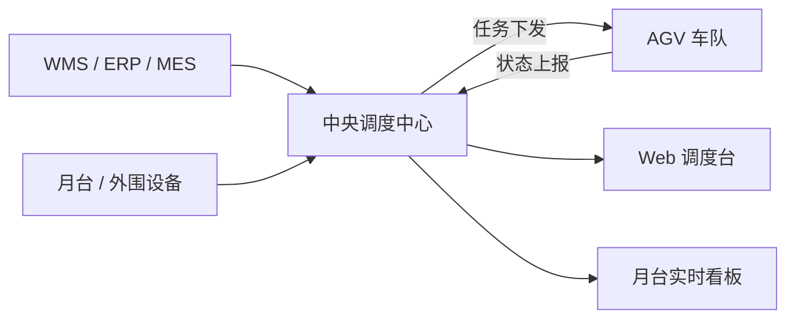
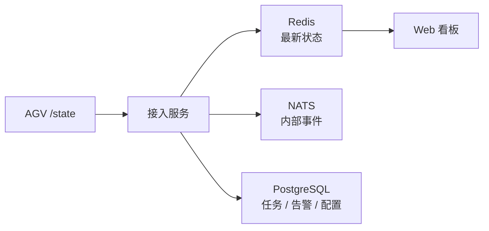
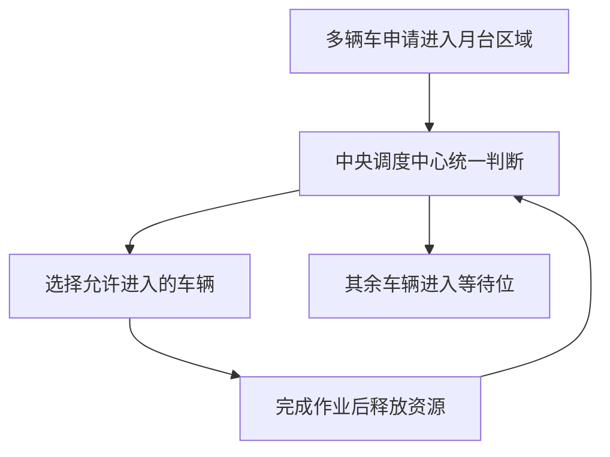
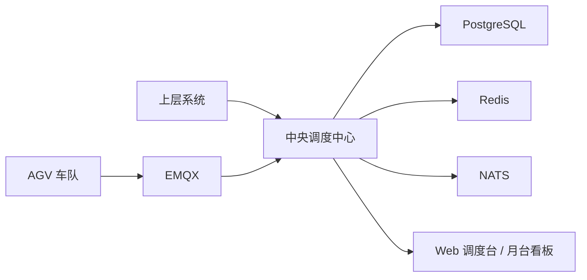

# AGV中央调度中心汇报版概览

## 1. 为什么需要中央调度中心

如果现场只有几台车、几个站点，用简单派单程序也许还能勉强运转；但一旦上升到多车、多月台、多系统并行协同，问题就不再是“能不能发任务”，而是：

- 谁先执行更合理
- 哪个月台现在能进
- 两辆车会不会在入口互相堵住
- 上层系统、Web 页面、设备状态是不是一致
- 某个系统出问题后，会不会拖垮全场运行

中央调度中心的价值，就是把这些原本分散、容易混乱的判断统一收口，形成一个稳定、可控、可扩展的运行中枢。

## 2. 为什么要按 1000 车 / 300 月台设计

这不是说项目一上线就一定会同时跑满 `1000` 台车、`300` 个月台，而是架构需要从一开始就避免“先小凑合，后面推翻重来”。

按高峰设计有三个直接好处：

- 后续扩容时不用整体重构
- 现场接更多月台和更多看板时不会一下子顶不住
- 上层系统和 AI 模块接入时，平台边界已经预留好

换句话说，这种设计是在给未来留余量，而不是给当前徒增复杂度。

## 3. 推荐技术路线

本方案推荐的核心技术路线是：

- `Go` 负责核心调度与实时处理
- `EMQX` 负责 AGV 的 MQTT 接入中转
- `PostgreSQL` 负责任务、配置、告警、审计等核心业务数据
- `Redis` 负责实时热状态、资源锁和看板读模型
- `NATS JetStream` 负责内部事件流转
- `Next.js + React + TypeScript` 负责 Web 调度台和月台看板

这套组合的重点不是“技术时髦”，而是比较符合工业现场要的几件事：

- 稳
- 快
- 好部署
- 好扩展
- 能长期维护

## 4. 系统怎么协同工作

简单理解，这套系统里有四类主要角色：

- 上层系统：下发任务需求
- AGV：执行搬运和状态上报
- 中央调度中心：统一判断、统一协调、统一下发
- Web 页面：给现场和管理人员看状态、看告警、做人工干预

### 简化总体架构图

中央调度中心的关键作用，不是单纯转发消息，而是决定：

- 这单任务给哪台车
- 这台车什么时候可以进月台
- 另一台车应该先在哪等
- 哪些状态需要推给哪个看板

## 5. 为什么数据库要分层

这是整套方案里非常关键的一点。

如果 `1000` 台车每秒都上报一次状态，那就是：

- 每秒 `1000` 条
- 每天 `8640` 万条

如果这些数据不分层，全压在一个普通业务库里，问题会很快出现：

- 写入压力大
- 查询越来越慢
- 历史数据膨胀很快
- 看板一多就容易和核心调度抢资源

所以数据库必须分工：

- `PostgreSQL` 存业务真相
- `Redis` 存最新状态和资源锁
- `NATS` 负责内部消息流
- 二期如果要做大量历史分析，再上专门的历史分析库

### 简化数据流图

这样做的核心好处是：看板再多，也尽量不要去影响调度主链路。

## 6. 为什么模板化对接很关键

客户现场的 `WMS/ERP/MES` 往往不是同一家供应商做的。  
如果每来一个客户就重新开发一套对接协议，会越来越重，后面维护也会越来越麻烦。

更合理的做法是：

1. 先定义平台自己的统一业务模型
2. 再把不同供应商的协议映射到这个统一模型
3. 形成可复用的对接模板

这样做之后，未来再接新客户，不一定每次都要从零写代码，很多时候只需要调整模板。

这也是后续 AI 能发挥价值的地方：  
AI 不一定直接接管系统，但很适合帮我们把一份新协议快速转换成模板候选。

## 7. 为什么调度策略是核心

真正难的地方，不是把任务发出去，而是把现场运行组织好。

举两个典型情况：

### 情况 1：一个月台两辆车

一个月台一次只能进一辆车。  
这时中央调度中心必须判断：

- 哪辆先进去
- 另一辆先去哪里等
- 等的时候不能堵住主干道

### 情况 2：两个月台各两辆车，而且位置很近

这时候问题就不是单个月台排队，而是两个月台周边的共享区域可能互相干扰。  
如果四辆车同时放进去，很可能就会在入口、转弯口或者交叉区域互相卡住。

所以系统必须把相邻月台当作一个“耦合资源区”统一考虑，而不是分开各管各的。

### 简化月台冲突处理图

这就是为什么调度中心是整个系统的核心，不是普通后台就能替代的。

## 8. 后续 AI 怎么接入

AI 以后可以做很多有价值的事，但不建议一开始就让 AI 直接控制调度主链路。

更稳妥的方式是先让 AI 做“旁路助手”：

- 帮忙看协议文档，生成对接模板建议
- 帮忙分析告警和异常
- 帮忙给出调度策略优化建议

这样既能利用 AI 的效率优势，又不会把生产现场的控制权交给一个不确定输出的模块。

## 9. 推荐实施路径

建议按下面的顺序推进：

1. 先把中央调度中心最小闭环做起来
2. 把月台、等待位、相邻月台冲突这些核心规则做稳
3. 把数据库分层、实时推送、看板读写分离做对
4. 再把北向模板化对接平台补齐
5. 最后再逐步引入 AI 辅助能力

### 简化部署关系图

## 10. 总结

这套方案的核心判断可以概括为三句话：

1. 中央调度中心必须是正式生产平台，而不是简单派单程序。
2. 数据库必须分层，不能让一个库同时扛实时状态、业务事务和大量历史分析。
3. 未来真正能拉开差距的，不只是车多不多，而是调度策略、模板化对接能力和 AI 扩展能力是否提前预留。

按这个方向建设，既能满足当前现场落地，也能为后续扩展、复制和升级打下比较稳的基础。
