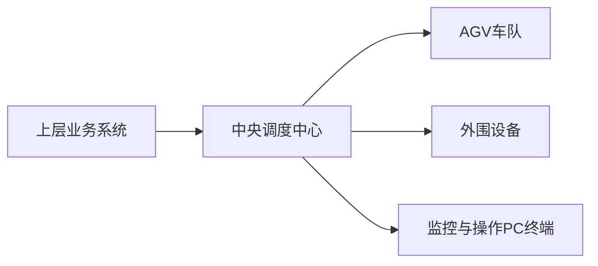
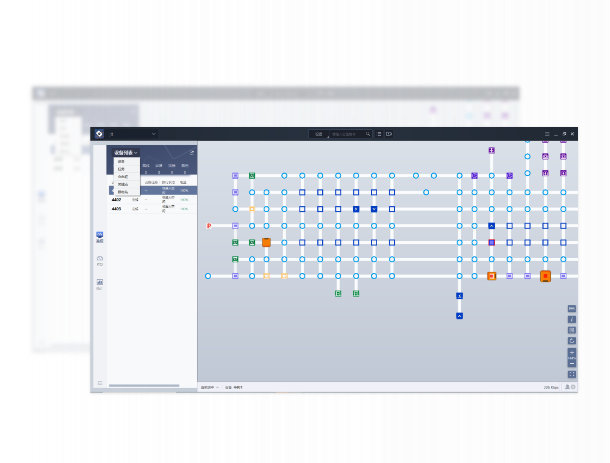
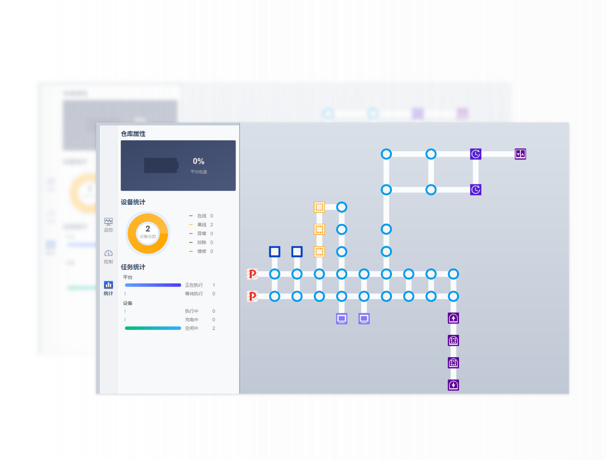
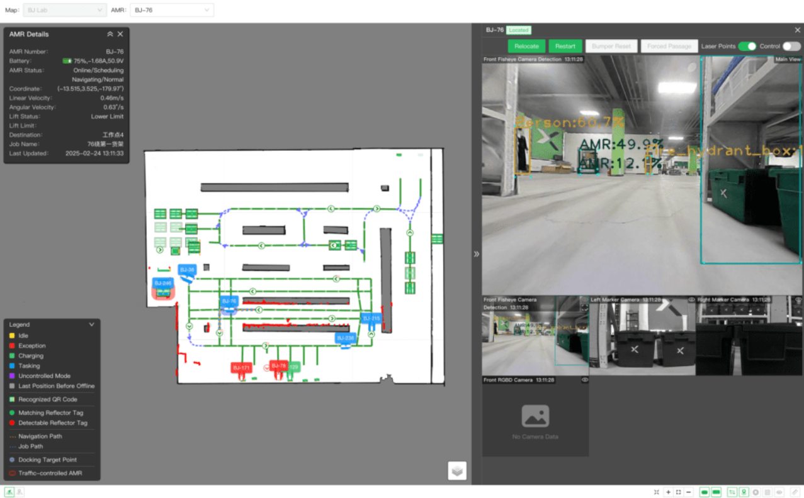
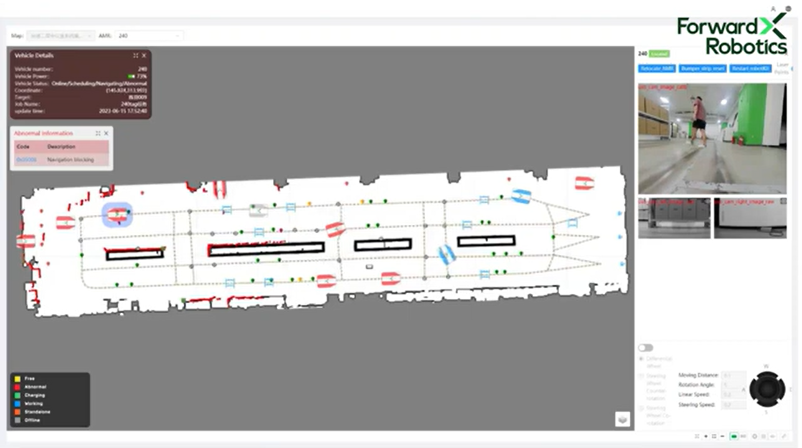
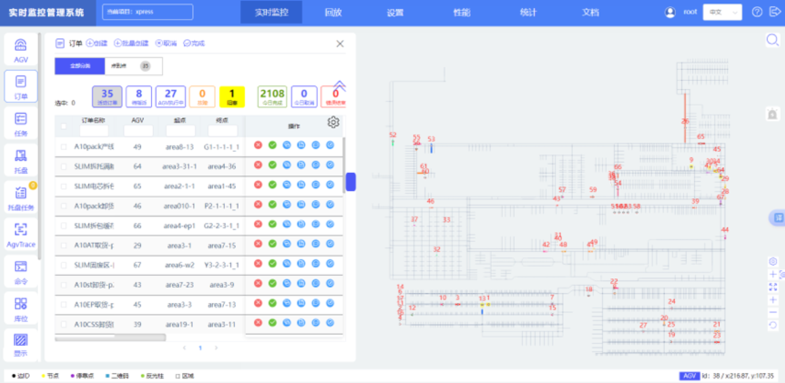
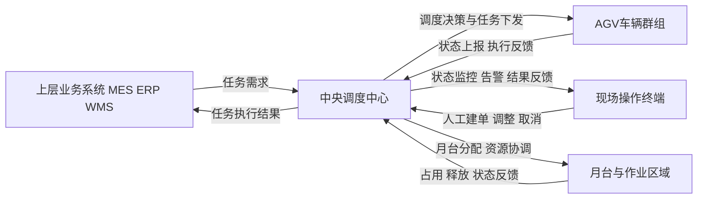
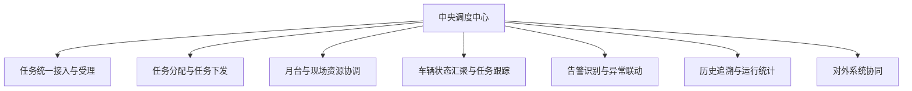
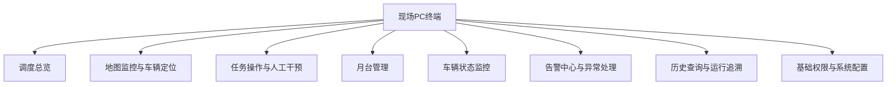

# AGV智能调度系统项目计划书

| 项目名称 | AGV智能调度系统       |
| -------- | --------------------- |
| 文档版本 | V1.0                  |
| 编制日期 | 2026年4月23日         |
| 编制单位 | AGV智能调度系统项目组 |

---

## 1. 行业主流产品参考与建设启示

### 1.1 主流 AGV 调度系统的总体架构趋势

结合当前主流 AGV/AMR 厂商的公开资料可以看出，成熟调度系统通常不是单一软件，而是一套完整的运行体系。  
从客户视角可以简单理解为，它们一般会包含以下几个部分：

1. 上层业务系统：ERP、MES、WMS 等系统下发搬运需求或作业指令。
2. 中央调度中心：统一接收任务、统一分配车辆、统一协调月台和现场资源。
3. AGV 车队：接收任务并执行搬运。
4. 外围设备：包括月台、门禁、输送线、电梯、传感器等现场资源。
5. 监控与操作 PC 终端：供现场人员查看状态、处理异常和进行人工操作。

从行业发展方向看，主流产品已经不再把调度能力做成单机测试工具，而是普遍采用“中央调度中心 + 现场操作终端”的方式统一管理车辆、任务和现场资源。

### 1.2 行业主流平台的通用架构模式

### 1.3 国内主流产品参考

国内主流 AGV 厂商一般都不是只卖“车辆”或“单个软件”，而是提供一整套系统。  
从公开资料来看，它们普遍会把“上层任务来源、调度中心、现场设备联动、可视化监控”整合在一起，形成一套完整方案。

简单来说，国内主流厂商通常有以下共同做法：

1. 由一个统一的调度中心接收任务，而不是让车辆各自独立运行。
2. 调度中心统一决定哪台车去执行、哪个月台可用、什么时候可以进入目标区域。
3. 系统不仅管理 AGV 本身，也会关注月台、门禁、输送线、电梯等现场资源。
4. 提供一套可视化界面，让管理人员随时查看车辆状态、任务状态和异常情况。

几个典型厂商的做法可以简单理解为：

1. 海康机器人
   - 更强调整体平台化和现场设备联动。
   - 一般会把调度、仓储/业务管理和现场设备协同放在同一套体系内考虑。
   - 对本项目的启示是：不能只看车辆调度，还要把月台和现场资源一起纳入系统管理。

2. Quicktron
   - 更强调多车协同和大规模运行。
   - 从公开资料看，其系统会同时关注任务下发、车辆运行、现场秩序和设备利用效率。
   - 对本项目的启示是：当车辆数量上来以后，系统必须具备统一协调和统一监控能力。

3. Geek+
   - 更强调“软件平台 + 场景方案”的整体性。
   - 除了车辆调度，还会考虑和上层业务系统、现场流程及可视化管理的结合。
   - 对本项目的启示是：系统不能只是一张地图，而是要形成可管理、可追溯、可扩展的平台。

总体来看，国内主流产品的共同方向是：  
**用统一调度中心把任务、车辆、月台和现场资源组织起来，再通过可视化终端进行统一监控和操作。**

### 1.4 国际主流产品参考

国际主流产品在总体思路上和国内厂商比较接近，也都是通过统一的调度中心来管理车队。  
它们通常更强调“系统之间可以方便对接”“不同类型设备可以接进来”“平台长期运行更稳定”。

可以简单理解为：

1. OTTO
   - 更强调统一管理和现场运行效率。
   - 会重点关注车辆使用效率、区域拥堵和任务执行顺序。
   - 对本项目的启示是：调度系统除了派单，还要考虑现场拥堵和资源利用率。

2. MiR
   - 更强调界面化管理和车队集中控制。
   - 公开展示中可以看到，其思路是让操作人员更方便地查看车队状态和任务分布。
   - 对本项目的启示是：操作终端必须足够直观，适合长时间值守与快速判断。

3. KUKA
   - 更强调不同设备和不同系统之间的兼容与统一管理。
   - 说明这类平台在后续扩展时，往往要考虑更多系统接入和更多设备类型。
   - 对本项目的启示是：即使第一版只做单工厂单站点，也应为后续扩展预留空间。

总体来看，国际主流产品给我们的主要借鉴是：  
**统一调度中心之外，还要重视系统开放性、可扩展性和长期运行稳定性。**

### 1.5 行业主流产品对本项目的建设启示

结合国内外主流产品的公开设计思路，可以归纳出以下建设启示：

1. 生产级 AGV 调度系统必须采用中央调度平台模式，而非延续单机测试工具模式。
2. 调度中心不能只做任务下发，还要同时管理车辆、月台、现场资源和异常情况。
3. 大规模车辆场景下，系统必须具备统一状态汇聚、统一告警、统一监控和统一追溯能力。
4. 与上层业务系统以及外围设备的协同能力，是成熟系统的重要组成部分。
5. 未来若需要扩展多区域、多站点或更多设备类型，当前架构应从一开始预留扩展空间。

### 1.6 行业主流地图呈现方式参考

行业里的“地图”通常不是单一图片，而是由“导航底图”和“调度覆盖层”叠加而成。导航底图用于机器人定位、路径规划和问题诊断；调度覆盖层用于表达站点、路段、区域、工位、车辆、任务和现场资源状态。因此不同厂商界面差异，很多时候不是思路不同，而是展示层次和面向角色不同。

#### 1.6.1 纯拓扑图

这类界面以点、线、箭头、站点和功能图标构成，不强调还原厂房真实轮廓，而强调交通关系、站点关系和资源占用关系。  
它最适合调度中心、值守人员和高频操作场景，优点是结构清楚、渲染轻量、便于做路径高亮、路段锁定、单行控制和拥堵分析。  
其局限在于现场人员第一次看时认知成本略高，需要对区域名称、工位语义和图标体系进行培训。

#### 1.6.2 SLAM 栅格图叠加拓扑

这类界面以 `pgm + yaml` 或其他导航地图作为底图，在其上叠加路径、站点、车辆、禁行区和实时诊断信息。  
它更适合实施、调试、售后和问题定位场景，优点是能同时看到现场轮廓、定位状态、规划路径、识别结果和异常区域，便于排查“定位漂移、障碍误识别、路径规划异常”等问题。  
如果当前系统直接使用 `pgm + yaml` 做主地图展示，那么它就属于这一类；若再叠加站点、路段和实时状态，则属于更完整的“栅格底图 + 调度覆盖层”做法。

#### 1.6.3 CAD/平面图淡化做背景

这类界面在地图底层放置厂房平面图、CAD、库区布局或区域轮廓，再在上层叠加车辆、任务、工位和告警信息。  
它更适合管理层、现场班组长和首次接触系统的用户，优点是认知成本低、区域语义强、便于和真实现场对应。  
其局限是底图通常更重，放大缩小时要注意清晰度，同时要避免背景过强影响实时状态识别。

#### 1.6.4 3D/数字孪生

这类界面通过三维模型、楼层结构或园区场景来呈现车辆、设备和区域状态，更适合客户演示、大屏展示、园区级运营看板和跨楼层复杂场景。  
它的优点是展示效果强、空间感好、适合表达跨区域联动；但日常高频调度时，操作效率未必优于 2D 地图，实施和维护成本也更高。  
从行业实际使用看，3D/数字孪生更适合作为展示层或管理层看板，而不一定替代一线调度员的主操作界面。

#### 1.6.5 对本项目的建议

结合当前第一版系统基础，建议将地图能力分层建设：

1. 保留现有 `pgm + yaml` 作为导航底图，用于定位、路径和调试诊断。
2. 在底图之上新增调度拓扑层，表达站点、路段、单行、限速、禁行区、充电位、月台和工位。
3. 在调度拓扑层之上新增实时状态层，表达车辆位置、朝向、任务路径、拥堵、告警和资源占用。
4. 运行监控默认优先提供“栅格底图 + 拓扑覆盖层”视图，并预留“纯拓扑视图”或“CAD 背景视图”切换能力。
5. 3D/数字孪生不建议作为当前阶段核心建设重点，可在后续客户展示、大屏看板或园区级扩展时再评估。

注：本节图片均来自已整理的厂商公开界面截图，仅作为产品规划参考。

### 1.7 参考资料说明

本节基于厂商官网公开资料整理，主要参考来源如下：

1. [海康机器人移动机器人系统软件](https://www.hikrobotics.com/cn/mobilerobot/software/)
2. [Quicktron Software](https://quicktron.com/software)
3. [Geek+ One-stop Software Suite](https://www.geekplus.com/en/)
4. [OTTO Fleet Manager](https://ottomotors.com/fleet-manager/)
5. [MiR Fleet Enterprise](https://mobile-industrial-robots.com/products/software/mir-fleet)
6. [KUKA.AMR Fleet](https://www.kuka.com/en-my/products/autonomous-mobile-robots-amr/amr-fleet-management-software)

## 2. 项目建设目标

### 2.1 总体目标

建设一套面向正式生产环境的 AGV 智能调度系统，形成统一调度中心和现场操作终端，实现厂房内多车、多任务、多月台场景下的集中调度、实时监控和异常告警。

### 2.2 具体目标

1. 支持单工厂单站点场景下最多 300 辆 AGV 的集中调度。
2. 支持几十到 100 个月台的占用、排队、释放与异常管理。
3. 实现车辆状态、任务状态、月台状态的统一可视化展示。
4. 实现任务创建、分配、执行、取消和完成确认的全过程闭环管理。
5. 实现在线离线、急停、电量、故障、定位状态等异常信息的统一告警。
6. 支撑生产环境稳定运行，并满足正式上线使用要求。

## 3. 总体建设方案

### 3.1 建设思路

本项目采用“中央调度中心 + 现场操作终端 + AGV 设备 + 现有通信环境”的总体建设方式。系统通过中心化管理模式，对现场 AGV 进行统一接入、统一任务下发、统一状态监控、统一异常告警和统一运行管理。

### 3.2 业务运行模式

系统建成后，任务入口统一由中央调度中心承接。  
当现场存在上层业务系统时，由上层系统向中央调度中心下发任务需求；当上层系统不直接下发任务时，由现场操作人员通过 PC 操作台发起人工建单、任务调整或取消请求，再由中央调度中心统一完成任务分配、资源协调和车辆下发。  
AGV 设备不直接与上层业务系统或现场操作终端形成调度控制关系，而是统一由中央调度中心进行管理，中央调度中心同时负责接收车辆状态反馈、管理月台资源并向上层系统或操作终端回传执行结果。

### 3.3 总体业务架构图

## 4. 业务功能规划

### 4.1 功能分层说明

本项目的业务功能由“中央调度中心业务功能”和“现场 PC 终端业务功能”两部分组成。  
中央调度中心负责统一接收任务请求、统一分配任务、统一管理车辆与月台资源、统一处理告警与运行数据；现场 PC 终端主要面向调度员和现场管理人员，承担监控查看、人工操作、告警处置和运行管理等职能。  
两者之间的关系为：PC 终端不直接向 AGV 发指令，而是向中央调度中心发起任务请求、调整请求和人工操作请求，再由中央调度中心统一执行与下发。

采用“中央调度中心 + 现场 PC 终端”拆分方式，主要有以下好处：

1. 调度能力集中，车辆、任务、月台和异常状态可以统一管理，不容易出现信息不一致。
2. 现场 PC 终端只负责显示和操作，界面更清晰，人员使用更方便。
3. 即使现场终端关闭、卡顿或重启，中央调度中心仍可继续保持系统核心运行。
4. 中央调度中心可以先对现场状态进行统一整理、统一判断、统一筛选，再把真正需要展示的信息提供给现场终端，有利于保证界面清晰、状态一致和运行稳定。
5. 避免现场 PC 终端直接承担所有原始数据接收、处理和协调压力，使现场终端更适合专注于监控查看和人工操作。
6. 更有利于后续扩展上层业务系统接入、外围设备联动和多角色使用场景。
7. 更适合生产环境长期稳定运行，也更符合主流 AGV 软件的建设方式。

两种建设方式的差异可以简单理解如下：

| 方案                        | 原始数据由谁接收 | 业务判断由谁完成 | 月台与资源状态由谁统一维护 | 现场 PC 关闭后系统是否还能继续运行 |
| --------------------------- | ---------------- | ---------------- | -------------------------- | ---------------------------------- |
| 全部集中在 PC 端            | 现场 PC          | 现场 PC          | 现场 PC                    | 不能                               |
| 中央调度中心 + 现场 PC 终端 | 中央调度中心     | 中央调度中心     | 中央调度中心               | 能                                 |

如果把所有功能都集中到一台 PC 上实现，通常会带来以下问题：

1. 调度、监控、告警、历史、配置全部堆在一个程序中，系统结构会更复杂，后期维护难度更高。
2. 一旦这台 PC 出现异常，可能同时影响监控、操作和核心调度能力，风险较大。
3. 当车辆数量增加、状态刷新频率提高后，单机负担会明显加重，不利于长期稳定运行。
4. 如果由现场终端直接承接全部原始数据，不仅界面压力更大，也不利于统一判断任务、月台和异常状态。
5. 后续若要接入上层系统或外围设备，扩展方式会更受限制。
6. 从正式生产系统角度看，不利于形成清晰的职责分工和长期演进路径。

### 4.2 中央调度中心业务功能

#### 4.2.1 任务统一接入与受理

中央调度中心统一接收来自上层业务系统或现场 PC 终端的任务请求，形成统一任务入口，避免多来源直接向车辆发指令造成调度混乱。

#### 4.2.2 任务分配与任务下发

中央调度中心根据车辆状态、任务优先级、月台资源状态和现场运行条件，对任务进行统一分配，并将调度结果下发给对应 AGV 执行。

#### 4.2.3 月台与现场资源协调

中央调度中心负责管理月台的占用、排队、释放和异常停用状态，协调现场作业资源，避免多车冲突和资源抢占。

#### 4.2.4 车辆状态汇聚与任务跟踪

中央调度中心统一接收 AGV 状态反馈，实时汇聚车辆在线离线、位置、电量、故障、任务执行状态等信息，并持续跟踪任务闭环过程。

#### 4.2.5 告警识别与异常联动

中央调度中心对离线、急停、低电、任务超时、月台冲突等异常进行统一识别与告警，并支撑后续处理流程闭环。

#### 4.2.6 历史追溯与运行统计

中央调度中心沉淀任务执行记录、车辆运行记录、告警记录和人工操作记录，为运行分析、管理复盘和持续优化提供数据支撑。

#### 4.2.7 对外系统协同

中央调度中心作为统一接口中枢，向上层业务系统回传任务执行状态、异常信息和运行结果，为后续系统协同与业务联动提供基础。

### 4.3 现场 PC 终端业务功能

#### 4.3.1 调度总览

PC 终端提供系统首页总览展示，集中呈现车辆总数、在线状态、任务执行情况、月台占用情况、异常数量等关键指标，帮助现场管理人员快速掌握整体运行状态。

#### 4.3.2 地图监控与车辆定位

PC 终端基于厂区地图展示 AGV 实时位置、方向和运行状态，支持选中指定车辆查看详细信息，并按需查看该车辆的运行轨迹和 `costmap` 信息，便于现场调度和问题定位。  
地图页面建议采用“导航底图层 + 调度拓扑层 + 实时状态层”的分层方式构建，其中导航底图可复用现有 `pgm + yaml` 地图，调度拓扑层用于表达站点和路段语义，实时状态层用于表达车辆、任务路径、告警和资源占用信息。

#### 4.3.3 任务操作与人工干预

PC 终端支持人工建单、任务调整、任务取消和必要的人工干预操作，但相关操作均通过中央调度中心统一受理和执行。

#### 4.3.4 月台管理

PC 终端支持查看月台状态、月台排队情况和月台异常情况，并支持授权人员进行月台人工处理和状态调整。

#### 4.3.5 车辆状态监控

PC 终端集中展示车辆在线离线、急停、电量、故障、定位状态等关键信息，并支持按车辆、状态、区域等维度进行筛选查看。

#### 4.3.6 告警中心与异常处理

PC 终端对离线、急停、低电、任务超时、月台冲突等关键异常进行提醒，并支持异常确认、处理跟踪和查看历史记录。

#### 4.3.7 历史查询与运行追溯

PC 终端支持对任务执行记录、车辆运行记录、异常记录和人工操作记录进行查询与追溯，便于现场复盘和运行分析。

#### 4.3.8 基础权限与系统配置

PC 终端支持基础账号权限管理和系统参数配置，保障系统运行规范化和管理可控。

### 4.4 中央调度中心业务功能图

### 4.5 现场 PC 终端业务功能图

